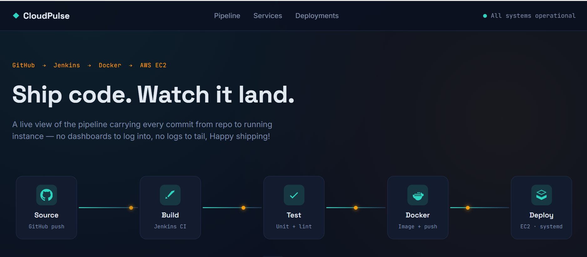
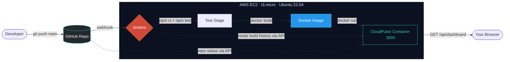
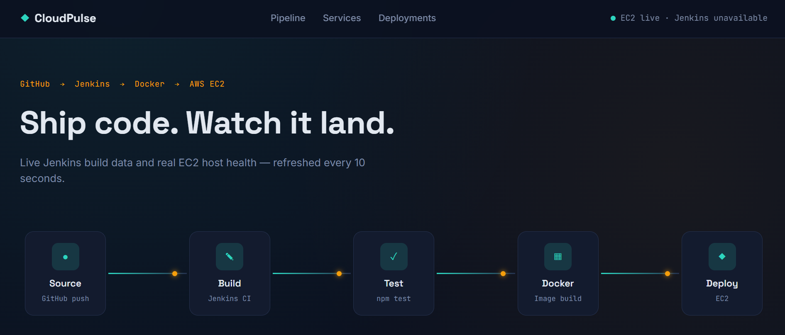
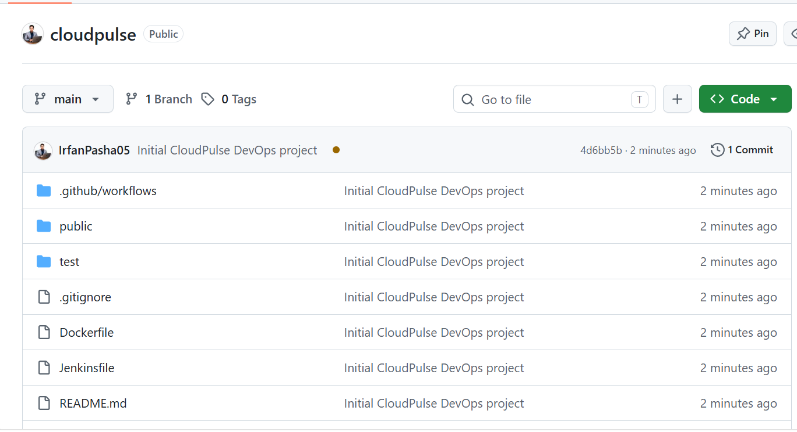
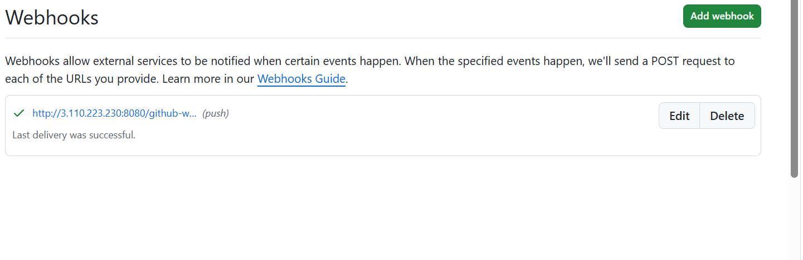

<div align="center">

# ⚡ CloudPulse

### A live dashboard for a real GitHub → Jenkins → Docker → AWS EC2 deployment pipeline

*No mock data on the deployment path. No dashboards to log into. No logs to tail.*

[](https://nodejs.org)
[](https://expressjs.com)
[](https://www.docker.com)
[](https://www.jenkins.io)
[](https://aws.amazon.com/ec2/)
[](LICENSE)

[](https://github.com/IrfanPasha05/cloudpulse/commits/main)
[](https://github.com/IrfanPasha05/cloudpulse/issues)
[](https://github.com/IrfanPasha05/cloudpulse/stargazers)

[Live Demo](http://3.110.223.230:3000) · [Report Bug](https://github.com/IrfanPasha05/cloudpulse/issues) · [Request Feature](https://github.com/IrfanPasha05/cloudpulse/issues)

</div>

<br/>



<br/>

## 📖 Table of Contents

- [What is this](#-what-is-this)
- [Architecture](#-architecture)
- [Tech stack](#-tech-stack)
- [Live data, not mock data](#-live-data-not-mock-data)
- [Screenshots](#-screenshots)
- [Getting started](#-getting-started)
- [Running with Docker](#-running-with-docker)
- [The CI/CD pipeline](#-the-cicd-pipeline)
- [API reference](#-api-reference)
- [Environment variables](#-environment-variables)
- [Project structure](#-project-structure)
- [Deploying your own copy](#-deploying-your-own-copy)
- [Roadmap](#-roadmap)
- [Lessons learned](#-lessons-learned)
- [Contributing](#-contributing)
- [License](#-license)

<br/>

## 🎯 What is this

**CloudPulse** is a dashboard that watches its own deployment pipeline. Every commit pushed to `main` flows through a real chain — **GitHub → Jenkins → Docker → AWS EC2** — and the dashboard shown above is a Node.js app running *inside that same pipeline*, reading Jenkins' build history and the EC2 host's live metrics through their real APIs.

It was built as a hands-on DevOps project to answer one question: *what does it actually take to run a self-deploying app on a single EC2 box, end to end, with no manual steps after `git push`?*

<br/>

## 🏗 Architecture



**Why one instance instead of separate Jenkins/app servers?** Simplicity and cost — this runs comfortably on a single free-tier-eligible `t3.micro`. Jenkins builds the Docker image and runs it directly on the same box, so there's no SSH-based remote deploy step and no image registry required. See [Roadmap](#-roadmap) for how this would scale to multiple hosts.

<br/>

## 🧰 Tech stack

| Layer | Technology |
|---|---|
| **Runtime** |  |
| **Server** |  |
| **CI/CD** |  — declarative pipeline, GitHub webhook trigger |
| **Containers** |  — multi-stage build, non-root runtime user |
| **Infra** |  Ubuntu 22.04, security-group gated |
| **Source control** |  webhook-driven triggers |
| **Frontend** | Vanilla HTML/CSS/JS — no framework, no build step |

<br/>

## 📡 Live data, not mock data

The dashboard's `/api/dashboard` endpoint calls out to two real sources on every page load:

- **Jenkins REST API** (`/job/<name>/api/json`) — authenticated with a scoped API token, returns real build numbers, results, and durations
- **GitHub REST API** (`/repos/<owner>/<repo>`) — public, unauthenticated, returns the real last-push timestamp and default branch

If either source is unreachable, the app **fails gracefully to clearly-labeled demo data** rather than crashing — the badge in the top right always tells you honestly which mode you're looking at.

<br/>

## 📸 Screenshots

<table>
<tr>
<td width="50%">

**Live pipeline + service health**



</td>
<td width="50%">

**Jenkins pipeline — green build**



</td>
</tr>
<tr>
<td width="50%" colspan="2">

**GitHub webhook — auto-deploy on push, zero manual steps**



</td>
</tr>
</table>

<br/>

## 🚀 Getting started

```bash
git clone https://github.com/IrfanPasha05/cloudpulse.git
cd cloudpulse
npm install
npm start
```

Open **http://localhost:3000** — it runs immediately with demo data if Jenkins/GitHub env vars aren't set.

<br/>

## 🐳 Running with Docker

```bash
docker build -t cloudpulse:latest .
docker run -d -p 3000:3000 --name cloudpulse cloudpulse:latest
```

Or with Compose:

```bash
docker compose up --build
```

<br/>

## 🔁 The CI/CD pipeline

The `Jenkinsfile` runs five stages on every push to `main`, triggered automatically by a GitHub webhook — no one clicks "Build Now":

| # | Stage | What happens |
|---|---|---|
| 1 | **Install dependencies** | `npm ci` — clean, reproducible install |
| 2 | **Test** | `npm test` — runs the test suite |
| 3 | **Docker Build** | Builds the multi-stage image, tagged `cloudpulse:latest` |
| 4 | **Deploy** | Removes the previous container, starts the new one with `--restart unless-stopped`, injects live credentials |
| 5 | **Health Check** | Polls `/healthz` until the new container responds — fails the build if it doesn't |

On failure, the `post` block cleans up so a broken container never sits there silently pretending to be healthy.

<br/>

## 🔌 API reference

| Route | Description |
|---|---|
| `GET /api/dashboard` | Full live payload — Jenkins builds, EC2 metrics, service health |
| `GET /api/health` | App-level uptime, host, load average |
| `GET /healthz` | Plain `200 OK` — used by Docker's `HEALTHCHECK` and the Jenkins pipeline |

<br/>

## ⚙️ Environment variables

| Variable | Default | Purpose |
|---|---|---|
| `PORT` | `3000` | Port the Express server listens on |
| `JENKINS_URL` | `http://localhost:8080` | Base URL of the Jenkins instance to read from |
| `JENKINS_JOB` | `CloudPulse-CI-CD` | Job name to pull build history from |
| `JENKINS_USER` | — | Jenkins username for the API token |
| `JENKINS_TOKEN` | — | Jenkins API token (injected as a Jenkins credential, never committed) |
| `GITHUB_REPO` | `IrfanPasha05/cloudpulse` | `owner/repo` used for the public GitHub status check |

None of these are required to run the app locally — omit them and it runs on demo data.

<br/>

## 📁 Project structure

```
cloudpulse/
├── .github/workflows/ci.yml   # GitHub Actions — build/test check on PRs
├── docs/screenshots/          # README screenshots
├── public/                    # Dashboard UI (HTML/CSS/JS, no build step)
├── test/                      # Test suite
├── Dockerfile                 # Multi-stage, non-root runtime, HEALTHCHECK
├── Jenkinsfile                # 5-stage declarative pipeline
├── docker-compose.yml         # Local/host container definition
├── index.js                   # Express server + live Jenkins/GitHub integration
└── package.json
```

<br/>

## 🌍 Deploying your own copy

1. Launch an Ubuntu 22.04 EC2 instance, open ports `22`, `8080` (Jenkins), and `3000` (app) in its security group.
2. Install Jenkins and Docker on the box; add the ubuntu and jenkins users to the `docker` group.
3. Fork this repo, create a Jenkins Pipeline job pointed at it (`Pipeline script from SCM`).
4. Generate a scoped Jenkins API token, store it as a Jenkins credential, and reference it in the `Deploy` stage via `withCredentials`.
5. Add a GitHub webhook pointing at `http://<your-ec2-ip>:8080/github-webhook/`.
6. Push to `main` and watch it deploy itself.

<br/>

## 🗺 Roadmap

- [ ] Separate Jenkins host from the app host (SSH-based deploy + Docker Hub/ECR registry)
- [ ] HTTPS via an Nginx reverse proxy + Let's Encrypt
- [ ] Slack/email notification stage on pipeline failure
- [ ] CloudWatch integration for historical metrics instead of point-in-time `os` stats
- [ ] Blue/green deploys to avoid the brief downtime during container swap

<br/>

## 🧠 Lessons learned

A few real bugs hit and fixed while building this — kept here because the debugging is the actual DevOps skill:

- **Post-block always tearing down the container** — an unconditional `docker rm -f` in `post` was deleting the container right after a successful health check. Fixed by moving cleanup into `post { failure { ... } }` only.
- **Jenkins restarting mid-build** — a `t3.micro` has only 1 GB RAM; `npm ci` + `docker build` running together tripped memory pressure and killed the durable task process. Fixed with a 2 GB swap file.
- **Jenkins API returning 403** — the app's live-data fetch needs its own scoped Jenkins API token passed in via `withCredentials`, distinct from login credentials, with the querying user granted `Job/Read` explicitly under matrix-based security.

<br/>

## 🤝 Contributing

Issues and PRs welcome. This is a learning project, so if something looks like a rookie mistake — it might be, and a PR explaining why is genuinely appreciated.

<br/>

## 📄 License

MIT — see [LICENSE](LICENSE).

<br/>

<div align="center">

Built by **[Irfan Pasha](https://github.com/IrfanPasha05)**

[](https://github.com/IrfanPasha05)

</div>
